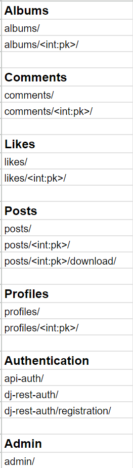

# Snaps - API

## Introduction

This is my RESTful API, developed for my frontend React project, Snaps.

It contains all the logic that allows users on the frontend to perform CRUD operations.

Snaps is a photo-sharing website that allows users to upload photos to share with others.

Any photos uploaded to the website is also free to download for other users, thereby creating a sharing community.

Users can sign up to take part in interactions such as, up- and downloading images, like, comment and save images to albums in their profile.

## Table of Contents

- [Introduction](#introduction)
- [Design](#design)
  - [Entity Relational Diagram](#entity-relational-diagram)
  - [API-endpoints](#api-endpoints)
- [Testing](#testing)
  - [Unit Tests](#unit-tests)
  - [Validation](#validation)

## Design

### Entity Relational Diagram

As a part of my design process, I charted my models on a spreadsheet.

This project was based on the [Moments](https://github.com/Code-Institute-Solutions/moments/tree/304244f540308ff4dd3c961352f55a633a4b3bed) walkthrough project,
and it will therefore exist code that is the same or similar

However I have made my own customizations to fit the plan for my project.

The [backend](https://github.com/Code-Institute-Solutions/drf-api/tree/ed54af9450e64d71bc4ecf16af0c35d00829a106) is for this reason inevitably similar to the one in the Moments project but I will point out som key differences here that make it my own.

- **My Like model:**

Unlike the one for Moments, my model allow users to like both posts and comments.

Also, posts and comments can be liked individually, not dependent on eachother.

- **My Post model:**

Unlike the one for moments, my model utilizes [django-taggit](https://django-taggit.readthedocs.io/en/latest/) to let users add tags to this posts.

This adds a level of searchability that the Moments project lacks.

I am also going to allow users to download images, and then keep track of how many times

the image of a post has been downloaded which my model accommodates.

- **My Album model**

The Moments project does not carry this feature at all.

It will allow users to save posts to albums that they can create on their profile page.

The result can be seen here:

### API Endpoints

These are the endpoints used by my API:

## Testing

### Unit Tests

I have created some 50 automated tests for my views, all passing.

- Tests for my Album views can be found here: [Album view tests](https://github.com/hogbergmarkus/snaps-backend/blob/main/albums/tests.py)

- Tests for my Comment views can be found here: [Comments view tests](https://github.com/hogbergmarkus/snaps-backend/blob/main/comments/tests.py)

- Tests for my Like views can be found here: [Likes view tests](https://github.com/hogbergmarkus/snaps-backend/blob/main/likes/tests.py)

- Tests for my Post views can be found here: [Posts view tests](https://github.com/hogbergmarkus/snaps-backend/blob/main/posts/tests.py)

- Tests for my Profile views can be found here: [Profile view tests](https://github.com/hogbergmarkus/snaps-backend/blob/main/profiles/tests.py)

### Validation

All files I created/altered were run through the [PEP8 CI python linter](https://pep8ci.herokuapp.com/), with no errors or warnings to show.
