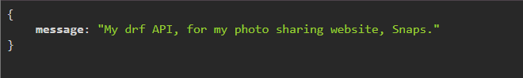
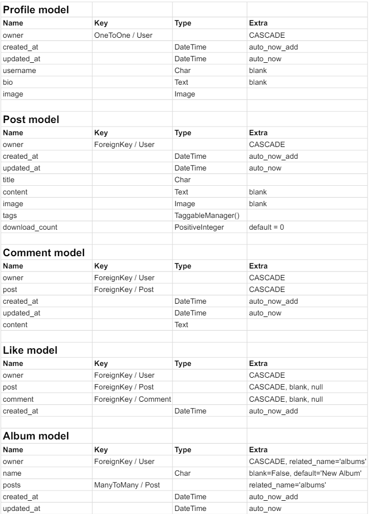

# Snaps - API

## Introduction

This is my RESTful API, developed for my frontend React project, Snaps.

It contains all the logic that allows users on the frontend to perform CRUD operations.

Snaps is a photo-sharing website that allows users to upload photos to share with others.

Any photos uploaded to the website is also free to download for other users, thereby creating a sharing community.

Users can sign up to take part in interactions such as, up- and downloading images, like, comment and save images to albums in their profile.

## Table of Contents

- [Introduction](#introduction)
- [Design](#design)
  - [Entity Relational Diagram](#entity-relational-diagram)

## Design

### Entity Relational Diagram

As a part of my design process, I charted my models on a spreadsheet.

The result can be seen here:

