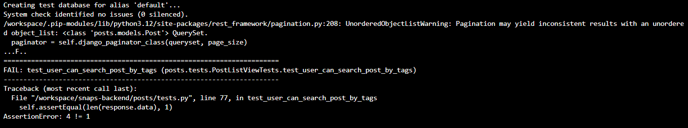
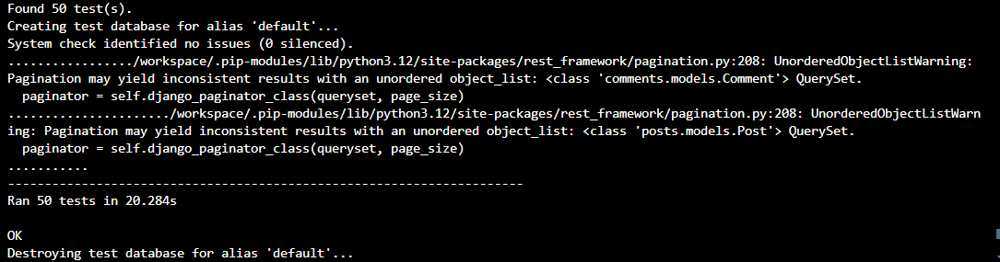
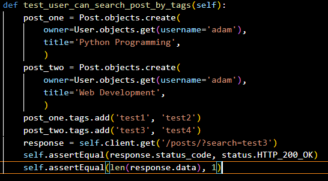
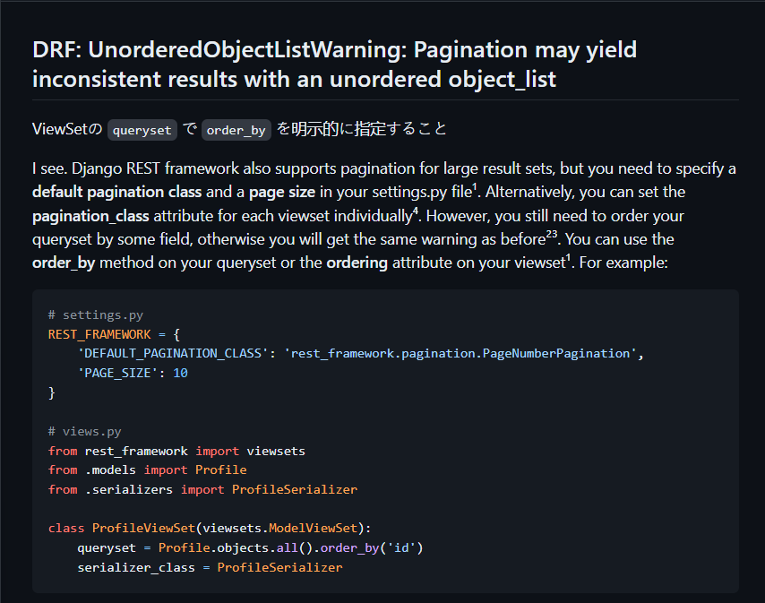
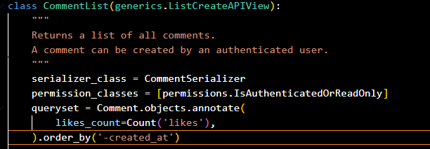

# Snaps - API

## Introduction


This is my RESTful API, developed for my frontend React project, Snaps.

It contains all the logic that allows users on the frontend to perform CRUD operations.

Snaps is a photo-sharing website that allows users to upload photos to share with others.

Any photos uploaded to the website is also free to download for other users, thereby creating a sharing community.

Users can sign up to take part in interactions such as, up- and downloading images, like, comment and save images to albums in their profile.

## Table of Contents

- [Introduction](#introduction)
- [Design](#design)
  - [Entity Relational Diagram](#entity-relational-diagram)
  - [API-endpoints](#api-endpoints)
- [Testing](#testing)
  - [Unit Tests](#unit-tests)
  - [Validation](#validation)
  - [Manual Testing](#manual-testing)
    - [root_route](#root_route)
    - [albums](#albums)
    - [comments](#comments)
    - [likes](#likes)
    - [posts](#posts)
    - [profiles](#profiles)
- [Deployment](#deployment)
  - [Cloning and Forking](#cloning-and-forking)
- [Technologies Used](#technologies-used)
  - [Languages](#languages)
  - [Frameworks](#frameworks)
  - [Libraries](#libraries)
    - [Authentication](#authentication)
    - [Database](#database)
    - [Image Handling](#image-handling)
    - [Utilities](#utilities)
  - [Database Used](#database-used)
  - [Image Storage](#image-storage)
  - [Deployment Service](#deployment-service)
- [Bugs](#bugs)
  - [Bug 1](#bug-1)
  - [Bug 2](#bug-2)
- [Fixed Bugs](#fixed-bugs)
  - [Bug Fix 1](#bug-fix-1)
  - [Bug Fix 2](#bug-fix-2)
- [Credits](#credits)
  - [Moments](#moments)

## Design

### Entity Relational Diagram

As a part of my design process, I charted my models on a spreadsheet.

This project was based on the [Moments](https://github.com/Code-Institute-Solutions/moments/tree/304244f540308ff4dd3c961352f55a633a4b3bed) walkthrough project,
and it will therefore exist code that is the same or similar

However I have made my own customizations to fit the plan for my project.

The [backend](https://github.com/Code-Institute-Solutions/drf-api/tree/ed54af9450e64d71bc4ecf16af0c35d00829a106) is for this reason inevitably similar to the one in the Moments project but I will point out som key differences here that make it my own.

- **My Like model:**

Unlike the one for Moments, my model allow users to like both posts and comments.

Also, posts and comments can be liked individually, not dependent on eachother.

- **My Post model:**

Unlike the one for moments, my model utilizes [django-taggit](https://django-taggit.readthedocs.io/en/latest/) to let users add tags to this posts.

This adds a level of searchability that the Moments project lacks.

I am also going to allow users to download images, and then keep track of how many times

the image of a post has been downloaded which my model accommodates.

- **My Album model**

The Moments project does not carry this feature at all.

It will allow users to save posts to albums that they can create on their profile page.

The result can be seen here:


### API Endpoints

These are the endpoints used by my API:


## Testing

### Unit Tests

I have created some 50 automated tests for my views, all passing.

- Tests for my Album views can be found here: [Album view tests](https://github.com/hogbergmarkus/snaps-backend/blob/main/albums/tests.py)

- Tests for my Comment views can be found here: [Comments view tests](https://github.com/hogbergmarkus/snaps-backend/blob/main/comments/tests.py)

- Tests for my Like views can be found here: [Likes view tests](https://github.com/hogbergmarkus/snaps-backend/blob/main/likes/tests.py)

- Tests for my Post views can be found here: [Posts view tests](https://github.com/hogbergmarkus/snaps-backend/blob/main/posts/tests.py)

- Tests for my Profile views can be found here: [Profile view tests](https://github.com/hogbergmarkus/snaps-backend/blob/main/profiles/tests.py)

### Validation

All files I created/altered were run through the [PEP8 CI python linter](https://pep8ci.herokuapp.com/), with no errors or warnings to show.

### Manual Testing

Each title under "Works" was tested manually and marked with an X for yes if it works, and no if it does not.

#### root_route

|Works                                              |YES |NO |
|---------------------------------------------------|:---:|---|
|The root_route url loads                           |X  |   |
|Welcome message is displayed on landing page       |X  |   |

#### albums

|Works                                                   |YES |NO |
|--------------------------------------------------------|:---:|---|
|`albums/` is not accessible if not logged in            |X  |   |
|`albums/<int:pk>/` is not accessible if not logged in   |X  |   |
|`albums/` is accessible to user if logged in            |X  |   |
|`albums/<int:pk>/` is accessible to user if logged in   |X  |   |
|Logged in user can create an album and add posts to it  |X  |   |
|Logged in user can view their albums                    |X  |   |
|Logged in user can update an album                      |X  |   |
|Logged in user can delete an album                      |X  |   |

#### comments

|Works                                                                |YES |NO |
|---------------------------------------------------------------------|:---:|---|
|`comments/` is accessible if not logged in as read only              |X  |   |
|`comments/<int:pk>/` is accessible if not logged in as read only     |X  |   |
|Can read, but not create comments if not logged in                   |X  |   |
|If I am signed in, I can create a comment                            |X  |   |
|Comments can not be edited if not logged in                          |X  |   |
|Comments can not be deleted if not logged in                         |X  |   |
|Comments can be edited by its owner                                  |X  |   |
|Comments can be deleted by its owner                                 |X  |   |

#### likes

|Works                                                                |YES |NO |
|---------------------------------------------------------------------|:---:|---|
|`likes/` is accessible if not logged in as read only                 |X  |   |
|`likes/<int:pk>/` is accessible if not logged in as read only        |X  |   |
|I can see but not add likes if not logged in                         |X  |   |
|If I am signed in, I can add a like to a post                        |X  |   |
|If I am signed in, I can add a like to a comment                     |X  |   |
|Likes can not be deleted if not logged in as the owner               |X  |   |
|Likes can be deleted if logged in as its owner                       |X  |   |
|I can not like the same thing twice                                  |X  |   |

#### posts

|Works                                                                    |YES |NO |
|-------------------------------------------------------------------------|:---:|---|
|`posts/` is accessible if not logged in as read only                     |X  |   |
|`posts/<int:pk>/` is accessible if not logged in as read only            |X  |   |
|`posts/<int:pk>/download/` is not accessible if not logged in            |X  |   |
|I can see but not add posts if not logged in                             |X  |   |
|If I am signed in, I can add a post                                      |X  |   |
|Posts can not be edited if not logged in as the owner                    |X  |   |
|Posts can not be deleted if not logged in as its owner                   |X  |   |
|Posts can be edited by its owner                                         |X  |   |
|Posts can be deleted by its owner                                        |X  |   |
|I can increment download count by posting to `posts/<int:pk>/download/`  |X  |   |
|comments_count increments by one when I add a comment to a post          |X  |   |
|likes_count increments by one when I add a like to a post                |X  |   |
|I can upload an image to a post                                          |X  |   |
|File extension must be jpg, jpeg or png when uploading an image          |X  |   |
|If file extension is not jpg, jpeg or png an error informs the user      |X  |   |

#### profiles

|Works                                                                |YES |NO |
|---------------------------------------------------------------------|:---:|---|
|`profiles/` is accessible if not logged in as read only              |X  |   |
|`profiles/<int:pk>/` is accessible if not logged in as read only     |X  |   |
|`profiles/<int:pk>/` is accessible if not logged in as read only     |X  |   |
|Upon registering, a new profile is created for the user              |X  |   |
|As the owner of a profile, I can update it                           |X  |   |
|I can add a profile image                                            |X  |   |
|If I don't own the profile, I can only view it                       |X  |   |

## Deployment

I started by setting up a database at [Elephant SQL](https://www.elephantsql.com/).

On [Heroku](https://www.heroku.com/) I created my app, then on the settings page for the app, I added the following config vars:

- DATABASE_URL with the value of my postgreSQL server url.
- SECRET_KEY with a value I got from [Djecrety](https://djecrety.ir/).
- DISABLE_COLLECTSTATIC with the value of 1.
- CLOUDINARY_URL with a value of my cloudinary API environment variable.

Back in my IDE, I installed dj_database_url and psycopg2, using the command:

- ```pip3 install dj_database_url==0.5.0 psycopg2```

Then import dj_database_url into the setting.py file.

In settings.py I updated the Database section to use my local db.sqlite3 server when I'm in development,

and to use my postgreSQL server when in production.

This is the code snipped to achieve that:

```
if 'DEV' in os.environ:
    DATABASES = {
        'default': {
            'ENGINE': 'django.db.backends.sqlite3',
            'NAME': BASE_DIR / 'db.sqlite3',
        }
    }
else:
    DATABASES = {
        'default': dj_database_url.parse(os.environ.get("DATABASE_URL"))
    }
```

I then added ```os.environ['DATABASE_URL'] = 'my-ElephantSQL-database-url'``` to my env.py file.

In my env.py file I also have ```os.environ['DEV'] = '1'```, to be able to set conditional logic in my settings.py,

so I can dynamically switch between development and production.

Temporarily comment out the DEV variable in the env.py file, to let the IDE connect
to the external database.

In settings.py add a print statement here:

```
else:
    DATABASES = {
        'default': dj_database_url.parse(os.environ.get("DATABASE_URL"))
    }
    print(connected to external database)
```

In the terminal, run:

- ```python3 manage.py makemigrations --dry-run```

You should see: "connected to external database" in the terminal.

Remove the print statement, and migrate the database:

- ```python3 manage.py migrate```

Create a superuser:

- ```python3 manage.py createsuperuser```

Head back over to [Elephant SQL](https://www.elephantsql.com/), and go to the database you just created.

On the left side navigation, click "Browser", then select "Table queries", and from the list, click "auth_user".

Finally click "Execute", and you should see your superuser.

Now back in the IDE, I installed gunicorn and django-cors-headers using the command:

- ```pip3 install gunicorn django-cors-headers```

Gunicorn is needed for deploying to Heroku, and we need django-cors-headers

since the frontend and backend will be hosted on different domains.

Save the installed packaged to requirements.txt by running:

- ```pip freeze --local > requirements.txt```

Create a Procfile in the root directory, and add this inside:

```
release: python manage.py makemigrations && python manage.py migrate
web: gunicorn <your-project-name>.wsgi
```

In settings.py I added: ```os.environ.get('ALLOWED_HOST')``` to ALLOWED_HOSTS,

and then in env.py: ```os.environ['ALLOWED_HOST'] = '<my-gitpod-workspace-url>'```

I did this after my first deployment, which didn't allow me to access my project,

but now I had the deployed url, so in my app on Heroku I went back to settings,

reveal config vars, and entered ALLOWED_HOST with a value of my deployed url.

Back in the IDE, add ```'corsheaders'``` to INSTALLED_APPS.

Add ```'corsheaders.middleware.CorsMiddleware',``` to the top of the MIDDLEWARE list in settings.py.

Continuing in settings.py, we need to set some allowed origins for CORS,

in order for network requests to not be blocked, note that this code is specific to the use of GitPod

and might need to be configured differently for you.

```
if 'CLIENT_ORIGIN' in os.environ:
    CORS_ALLOWED_ORIGINS = [
        os.environ.get('CLIENT_ORIGIN')
    ]
if 'CLIENT_ORIGIN_DEV' in os.environ:
    extracted_url = re.match(
        r'^.+-', os.environ.get('CLIENT_ORIGIN_DEV', ''),
        re.IGNORECASE
        ).group(0)
    CORS_ALLOWED_ORIGIN_REGEXES = [
        rf"{extracted_url}(eu|us)\d+\w\.gitpod\.io$",
    ]
```

We also need to make sure we can send cookies cross-origin for authentication purposes.

So add ```CORS_ALLOW_CREDENTIALS = True``` to settings.py.

Since the frontend app and this API will be deployed to different urls,

the JWT_AUTH_SAMESITE needs to be set to a value of None in settings.py, or cookies will be blocked:

```
REST_AUTH = {
    'USE_JWT': True,
    'JWT_AUTH_SECURE': True,
    'JWT_AUTH_COOKIE': 'my-app-auth',
    'JWT_AUTH_REFRESH_COOKIE': 'my-refresh-token',
    'JWT_AUTH_SAMESITE': 'None',
    'USER_DETAILS_SERIALIZER': 'snaps_api.serializers.CurrentUserSerializer'
}
```

Double check that you replaced your SECRET_KEY with something similar to this:

```SECRET_KEY = os.getenv('SECRET_KEY')```, and that you have set a new value for it

in env.py or another file that you don't push anywhere near public eyes.

I added this to my env.py: ```os.environ.setdefault("SECRET_KEY", "MyNewRandomValueHere")```

I changed the DEBUG value in settings.py to: ```DEBUG = 'DEV' in os.environ```,

this helps to not constantly have to switch DEBUG between True and False in development.

Now I commented ```DEV``` back in, in env.py.

Again, I made sure my requirements.txt was up to date, and then pushed to GitHub.

On Heroku, open the deploy tab for the app, select "Connect to GitHub",

search for the repository and click connect.

Finally click "Deploy Branch". After it finished building my app opened and worked as expected.

### Cloning and Forking

If you want to clone or fork this project, you can do it from my [GitHub repository](https://github.com/hogbergmarkus/snaps-backend)

Setting up a virtual environment is recommended first.

**Cloning** the project means you are creating a local copy of the project on your own machine.

This enables you to make changes without affecting the original repository.

**Forking** it means you are creating a copy of the project on your own GitHub account,

which gives you the ability to propose changes to the original project,

or just developing your own modified version of it.

Then you will need to reinstall the dependencies in the requirements.txt file using this command:

- ```pip install -r requirements.txt```

You will also need to set up your own environment variables

## Technologies Used

### Languages

This api was written using Python.

### Frameworks

- Django
  
  The core framework, providing the foundation for this api.

- django-rest-framework
  
  A framework building on top of Django, used for creating RESTful APIs.

### Libraries

#### Authentication

- dj-rest-auth
  
  Lets django-rest-framework provide authentication endpoints in an easy way.

- django-allauth
  
  Comprehensive authentication app for Django.

- djangorestframework-simplejwt
  
  JSON Web Token based authentication, which will be used for authentication from the frontend.

#### Database

- dj-database-url
  
  Used to help parse urls for easy configuration in Django.

- psycopg2
  
  A PostgreSQL adapter for Python.

#### Image Handling

- cloudinary
  
  Used to interact with Cloudinary, cloud based image storage.

- django-cloudinary-storage
  
  Integrates Cloudinary to be able to use it as storage for media in Django.

- Pillow
  
  Used for image processing.

#### Utilities

- gunicorn
  
  A WSGI server used in production, needed for deployment.

- django-cors-headers
  
  Adds Cross-Origin Resource Sharing headers. Used to allow requests to a Django application from other origins.

- django-taggit
  
  Used for adding tags to Posts in this project, makes it easier for users to search content.

### Database Used

I used a PostgreSQL database for this project, at [Elephant SQL](https://www.elephantsql.com/).

### Image Storage

[Cloudinary](https://cloudinary.com/) was used for image storage.

### Deployment Service

[Heroku](https://www.heroku.com/) was used to deploy the project.

## Bugs

### Bug 1

After I added pagination to my project, some of my unit tests failed,

more specifically tests that related to search features, such as searching for posts.

The fail message can be seen here:



### Bug 2

Upon resolving Bug 1, my unit tests were now passing again.

However I was still getting a warning that pagination might cause issues, message seen here:



## Fixed Bugs

### Bug Fix 1

After doing some research I found that I had most likely made mistakes in my assertions.

I found my answer here on [stackoverflow](https://stackoverflow.com/questions/30914557/how-to-test-response-contains-a-particular-key-and-value)

Here is what my test looked like when it failed:



After changing the last assertion to: ```self.assertEqual(response.data['count'], 1)```, my tests passed again.

### Bug Fix 2

This bug and bug fix can be seen as a part of bug 1.

Even after I changed the assertions in my tests, and the tests passed, I was getting a warning, as seen in [Bug 2](#bug-2).

I googled the warning and found an answer on [GitHubGist](https://gist.github.com/hdknr/46723c4fa2639b9bc78fe52cdad903b0).



I then added ordering to my querysets in my views where it was an issue and the warning went away.



## Credits

### Moments

While this project was inspired by [Moments](https://github.com/Code-Institute-Solutions/moments/tree/304244f540308ff4dd3c961352f55a633a4b3bed)
and its backend [drf_api](https://github.com/Code-Institute-Solutions/drf-api/tree/ed54af9450e64d71bc4ecf16af0c35d00829a106),
and there are many similarities in the code,

I have created my own Post, Like and Album models to suit the needs of my project,

and therefore there are other differences in the codebase as well.

I chose to use the same default images for profiles and posts if no image is uploaded by the user,

since they were already in place in my Cloudinary storage, and fulfilled my needs.
